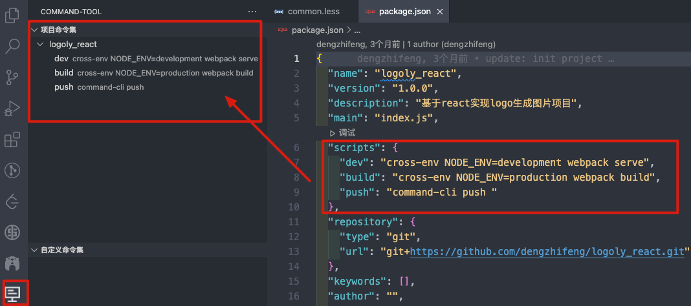

# CommandTool

### en:
This is an extension that can quickly execute project commands, which can be run with the click of a button. At the same time, it supports custom project commands, global project commands, and one-click running commands.

### zh-cn:
这是一个可以快速执行项目命令的拓展，通过按钮点击即可运行项目命令。同时支持自定义项目命令、全局项目命令，支持一键运行命令。

## Features

### en:
- Run commands with one click
- Automatically obtain project commands and display them in the form of a file directory tree
- Customize commands in the project, support adding, deleting, and modifying
- Set the global workspace command of vscode

### zh-cn:
- 一键运行命令
- 自动获取项目命令，并且用文件目录树形式显示
- 在项目自定义命令，支持增删改
- 设定vscode的全局工作空间命令

## Usage
### Project-Command(项目命令集) 
自动获取项目命令，并且以文件目录树形式展示，点击运行按钮即可运行命令。

### navigation

Add Command - Add Folder - Update Explorer

### command list

## [1.0.0] - 2022-03-27
###  Added
- Basic command explorer
- command executer
- license
- README
- icon

-----------------------------------------------------------------------------------------------------------
## License
MIT

**Happy Coding!**  😎

