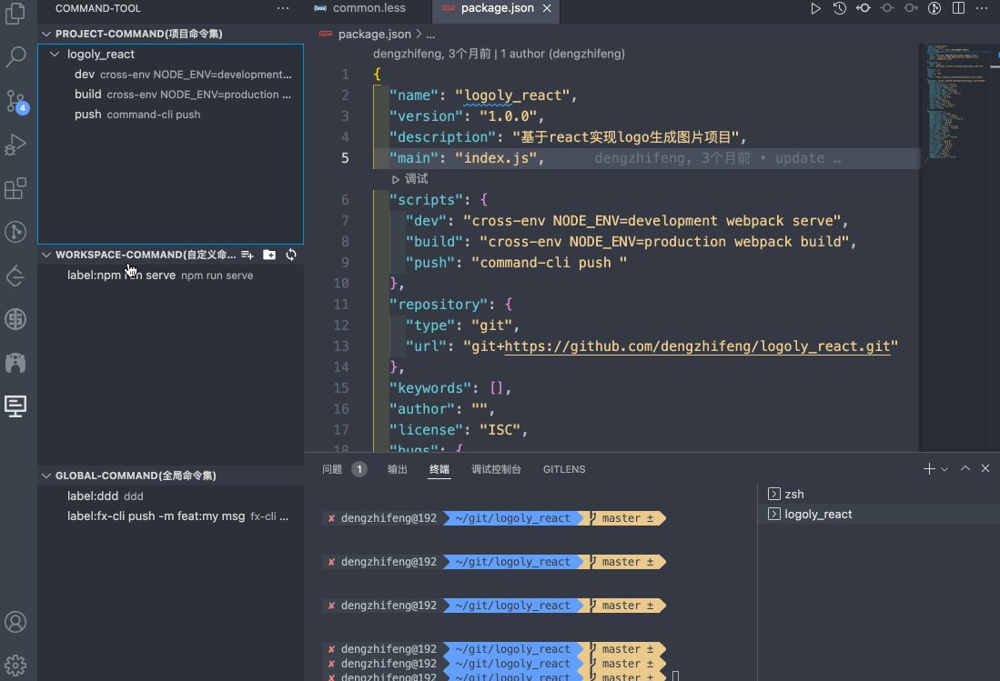
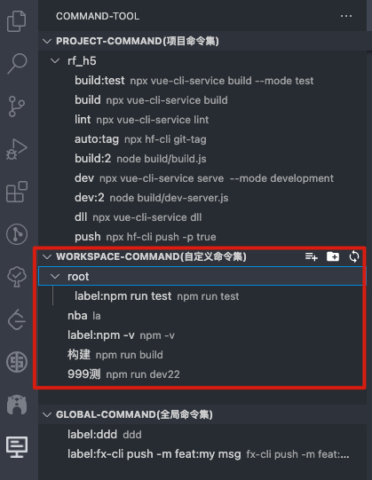
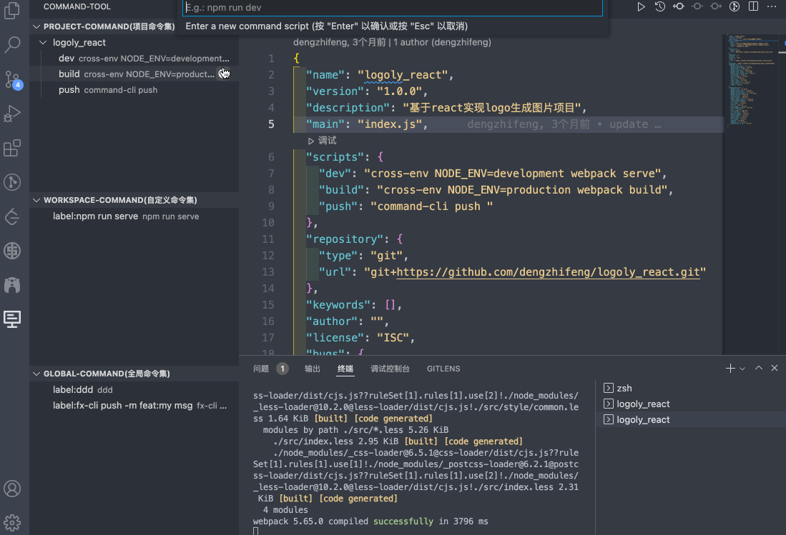
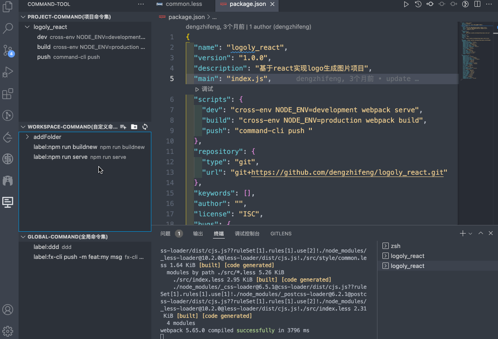
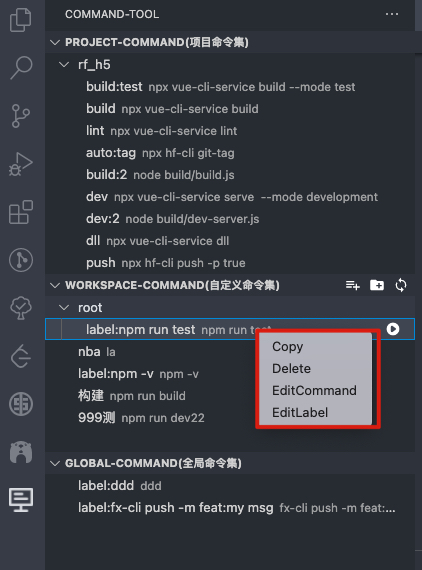
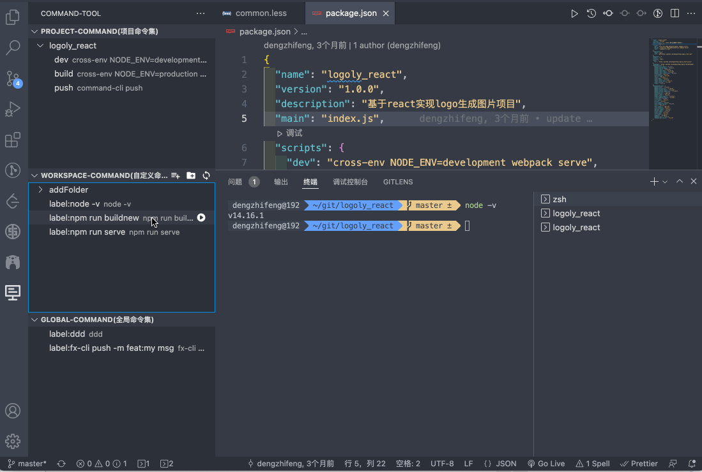

# CommandTool
[](https://marketplace.visualstudio.com/items?itemName=stevendeng.commandTool)
[](https://marketplace.visualstudio.com/items?itemName=stevendeng.commandTool)
[](https://marketplace.visualstudio.com/items?itemName=stevendeng.commandTool)
[](https://marketplace.visualstudio.com/items/stevendeng.commandTool/license)

[Englist Readme](README-EN.md)

这是一个可以快速执行项目命令的拓展，通过按钮点击即可运行项目命令。同时支持自定义项目命令、全局项目命令，支持一键运行命令。解决了大家记不住命令的痛点，用鼠标点击就可以运行命令了。同时支持复制命令，可复制到其他终端运行。

## Features

- 一键运行命令
- 自动获取项目命令，并且用文件目录树形式显示
- 在项目自定义命令，支持增删改
- 设定vscode的全局工作空间命令

## Usage
### Project-Command(项目命令集) 
自动获取项目命令，并且以文件目录树形式展示，点击运行按钮即可运行命令。



配置打开的vscode终端信息, 目前提供三个配置，暂时只作用于Project-Command(项目命令集) 的tab。
```
"commandTool.splitTerminal": {
    "description": "是否支持分割终端，默认支持",
    "default": true,
},
"commandTool.autoRunTerminal": {
    "description": "是否自动运行脚本，默认自动运行",
    "default": true,
},
"commandTool.TreeItemCollapsibleState": {
    "description": "是否折叠命令列表",
    "default": false,
}
```
settings.json配置示范：
```
  "commandTool.splitTerminal": false,
  "commandTool.autoRunTerminal": true,
  "commandTool.TreeItemCollapsibleState": false,
```

## WorkSpace-Command(自定义命令集)
自定义当前工作项目目录下的命令，新增的目录会保存在当前工作空间或者当前项目，可以增加一个通用命令，在任意项目运行，达到共享的效果。

- 添加命令  
- 添加目录 
- 刷新目录


Add Command
Add Folder

Run Custom Command 



## Command Menu

- 复制命令
- 删除命令
- 编辑命令
- 编辑标签



可以复制命令，可以编辑命令标签，对命令分类更加清晰，给每个命令增加解释。


## Global-Command(全局命令集)
可以增加自定义命令，会保存在vscode的全局空间，可作用于任意项目使用。

## Github
如果觉得好用，欢迎给star🌟，非常感谢🙏
[https://github.com/dengzhifeng/commandTool](https://github.com/dengzhifeng/commandTool)

-----------------------------------------------------------------------------------------------------------
## License
MIT

**Happy Coding!**  

